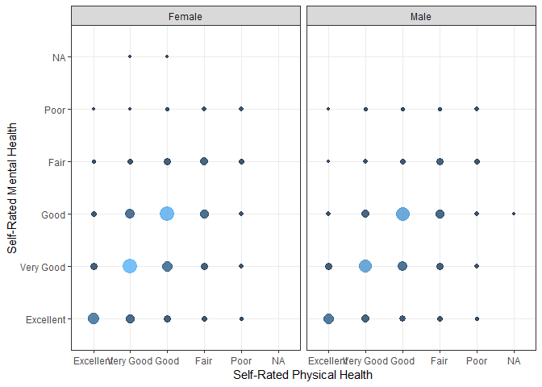

Draft
================
Final Project
11/17/2018

Importing data

``` r
load("./data/Wave 1/DS0001/34315-0001-Data.rda")
load("./data/Wave 2/DS0001/37105-0001-Data.rda")
load("./data/Wave 3/DS0001/37106-0001-Data.rda")

wave_1_data = da34315.0001
wave_2_data = da37105.0001
wave_3_data = da37106.0001
```

Creating Graphs

``` r
heatmap = wave_3_data %>% 
  select(PH001, PH002, SEX) %>% 
  mutate(physical = case_when(
    PH001 == "(01) Excellent" ~ "Excellent", 
    PH001 == "(02) Very Good" ~ "Very Good",
    PH001 == "(03) Good" ~ "Good", 
    PH001 == "(04) Fair" ~ "Fair", 
    PH001 == "(05) Poor" ~ "Poor"), 
    
  mental = case_when(
    PH002 == "(01) Excellent" ~ "Excellent", 
    PH002 == "(02) Very Good" ~ "Very Good",
    PH002 == "(03) Good" ~ "Good", 
    PH002 == "(04) Fair" ~ "Fair", 
    PH002 == "(05) Poor" ~ "Poor"),
  
  sex = case_when(
    SEX == "(1) Male" ~ "Male",
    SEX == "(2) Female" ~ "Female"
  ),
  
  physical = factor(physical, levels = c("Excellent", "Very Good", "Good", "Fair", "Poor")), 
  
  mental = factor(mental, levels = c("Excellent", "Very Good", "Good", "Fair", "Poor"))
        ) %>% 
  select(-PH001, -PH002, -SEX)

heatmap %>%
  ggplot(aes(x = physical, y = mental, color = ..n..)) +
  geom_count(alpha = 0.8) +
  labs(
    x = "Self-Rated Physical Health",
    y = "Self-Rated Mental Health"
  ) +
  facet_grid(~sex) +
  theme_bw() +
  theme(legend.position = "none")
```



``` r
wave_1_data = wave_1_data %>% 
  mutate(MHUCLA_LONELINESS_1 = MHUCLA_LONELINESS)

wave_2_data = wave_2_data %>% 
  mutate(MHUCLA_LONELINESS_2 = MHUCLA_LONELINESS)

wave_3_data = wave_3_data %>% 
  mutate(MHUCLA_LONELINESS_3 = MHUCLA_LONELINESS)

spaghetti = 
  merge(wave_1_data, wave_2_data, by = "ID") %>% 
  merge(wave_3_data, by = "ID") %>% 
  select(ID, SEX.x, CS006, MHUCLA_LONELINESS_1, MHUCLA_LONELINESS_2, MHUCLA_LONELINESS_3) %>% 
  arrange(ID)
```
